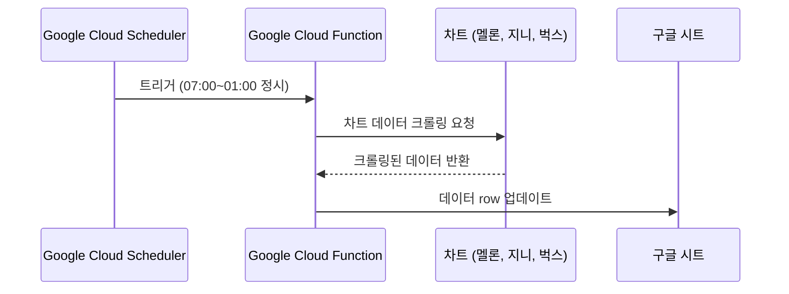

# 차트 트래커
- 차트 트래킹 스프레드 시트 : https://docs.google.com/spreadsheets/d/1ybI1XGWPHFIWlJJ9S74-r4Y1qTNsbooge1eBvOywkWU

## 개요
- 곡 제목을 기준으로 현재 순위를 크롤링해 구글 스프레드 시트에 업데이트
- 멜론 : HOT100 30일 차트, 100일 차트, 좋아요 수
- 지니 : 실시간 차트, 좋아요 수, 청취자 수, 재생 수
- 벅스 : 실시간 차트, 좋아요 수
- Google Cloud Functions + Google Scheduler 이용해 매 정시 작동 자동화

## 기능 명세

## 에러와 에러 해결
1. GCF 배포 전 테스트 시 환경변수 `None`으로 잡히는 이슈
   - 런타임 변수, 빌드 변수, os에러로 접근, 런타임환경(3.12 -> 3.8) 변경 등 시도해봤으나 모두 같은 현상 반복됨.
   - 환경변수 수정 시 반드시 배포를 해야 변경내용이 반영된다는 공식문서 내용을 기반으로 테스트 환경에서는 환경변수가 잡히지 않는것이 정상이라는 추정에 이름.
   - 트리거 함수가 환경변수를 print 하도록 작성하고 배포. 로그를 확인하니 필요한 환경변수 내용이 제대로 찍히는 것이 확인됨.
   - 환경변수가 필요한 부분은 테스트 환경이 아닌 배포 후 로그를 통해 정상작동하는지 확인하기로 함.
3. 00시 데이터 들어오지 않는 이슈
   - GCF 로그 확인 : GCF 실행 에러로 스케쥴러가 반복 시도하는 정황 확인됨.
   - 지니 차트 크롤링을 반복해서 재시도하는것 확인.
   - 지니 페이지에서 00:00시에 차트 타임 01:00으로 찍혀있는 현상 확인(지니쪽 에러로 추정됨. 순위는 00:00와 01:00시에 다르게 들어옴.)
   - `time_now`가 00:00이고 `genie_time_now`가 01:00인 경우 조건문을 사용해 `genie_time_now = 00:00`으로 재정의해줌
