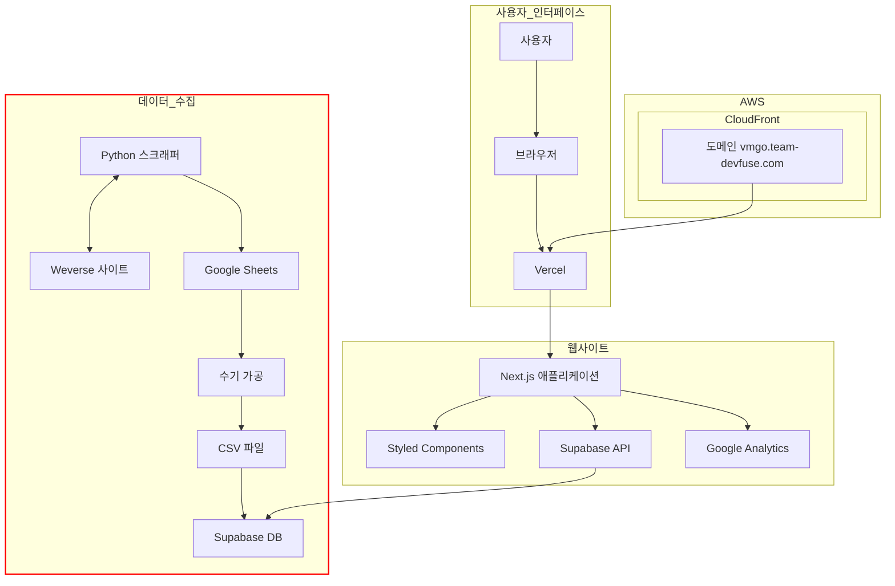
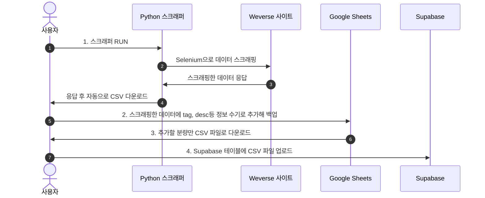

# 위버스 스크래퍼
## 개요
VMGO_search(https://team-devfuse.com/vmgo) 에서 사용할 데이터 수집을 위한 위버스 스크래퍼입니다.

## VMGO_search
### 기획의도
- Vlive -> Weverse 이관 후 구 주소 리다이렉트 지원하지 않아 기존에 팬덤이 노션으로 아카이빙 해 온 자료의 유효성이 사라짐.
- Weverse에서 날짜나 아티스트별 서치 지원하지 않아 신규 팬 유입 시 복습이 어려움.
- 기존의 노션 백업 데이터와 Weverse 스크래핑 데이터를 합쳐서 위 불편함 해소, 팬들이 원하는 라이브 영상을 손쉽게 찾을 수 있도록 보강함.

### 아키텍쳐

### 데이터 백업 플로우

