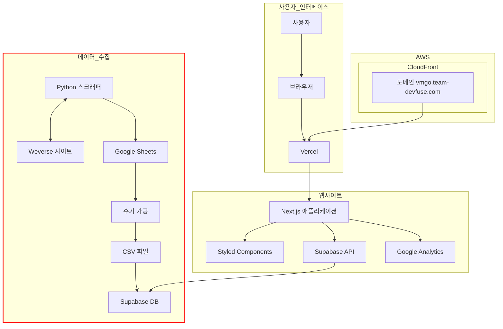
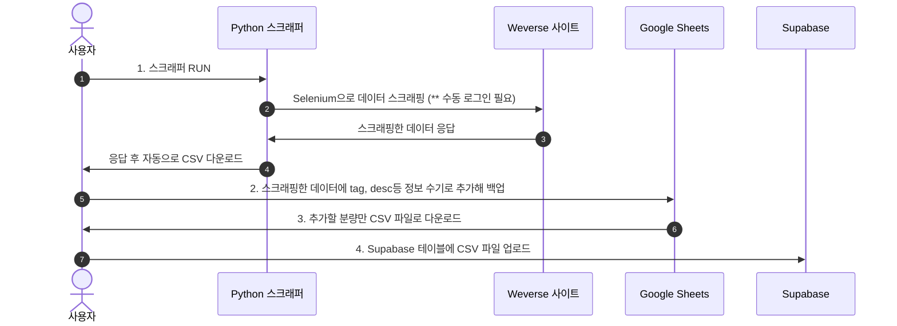

# 위버스 스크래퍼
## 개요
아카이브 데이터 수집을 위한 위버스 스크래퍼입니다.
위버스 라이브 리스트의 썸네일을 기준으로 제목, 재생시간, 날짜, 링크, 썸네일링크, 멤버, 팬십여부를 수집합니다.

## VMGO_search
### 기획의도
- Vlive -> Weverse 이관 후 구 주소 리다이렉트 지원하지 않아 기존에 팬덤이 노션으로 아카이빙 해 온 자료의 유효성이 사라짐.
- Weverse에서 날짜나 아티스트별 서치 지원하지 않아 신규 팬 유입 시 복습이 어려움.
- 기존의 노션 백업 데이터와 Weverse 스크래핑 데이터를 합쳐서 위 불편함 해소, 팬들이 원하는 라이브 영상을 손쉽게 찾을 수 있도록 보강함.

### 아키텍쳐

### 데이터 백업 플로우

## 스크래퍼 에러와 에러 해결
1. thumbnail 객체 오류로 스크래퍼 동작 정지
- 스크래퍼 동작 시 thumbnail 객체를 찾을 수 없다는 에러 메세지 계속 됨. css 쿼리 확인했으나 수정된 것 없음.
- Weverse 확인 결과 observer로 화면에 썸네일 영역 감지된 경우에만 img 태그 렌더하는 방식으로 업데이트 됨.
- try-except로 예외처리 추가해 썸네일 url 찾지 못해도 스크래퍼 동작하도록 수정.
- 스크래퍼 사용 시 읽어오고 싶은 만큼 충분히 스크롤을 해주는 방식으로 사용. (주로 스크롤이 필요 없는 상단 최신 데이터를 불러오는 용도로 제작했으므로 코드 추가 X)
